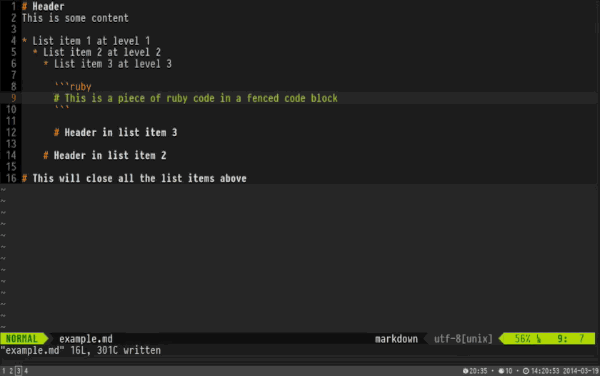

# Markdown for Vim -- MarkdownEditBlock

Extract the `MarkdownEditBlock` command from
[gabrielelana/vim-markdown](https://github.com/gabrielelana/vim-markdown)

## Installation

**vim-plug:**

If you use [vim-plug](https://github.com/junegunn/vim-plug), add the following
to your plugin section:

    Plug 'Chandlercjy/vim-markdown-edit-code-block', { 'for':'markdown'}

And then execute the following command in your shell:

    $ vim +PlugInstall

## Configuration

add the following line to your ~/.vimrc

```vim
autocmd FileType markdown nmap <buffer> <silent> <leader>e :MarkdownEditBlock<CR>
```

## Features

- Code blocks and pieces of Markdown in the current file can be edited in a
  separate buffer and synchronized back when you finish
  - Inside a Ruby fenced code block, `<Leader>e` opens a temporary buffer with
    the right file type
  - Select a range in visual mode and `<Leader>e` opens a temporary buffer with
    file type `markdown`. I call it _Focus Mode_ because you can edit a portion
    of a Markdown file in isolation
  - Finally, on an empty line, `<Leader>e` asks for a file type and then opens a
    temporary buffer with that file type
  - When you leave the temporary buffer the content syncs back to the main file
    
